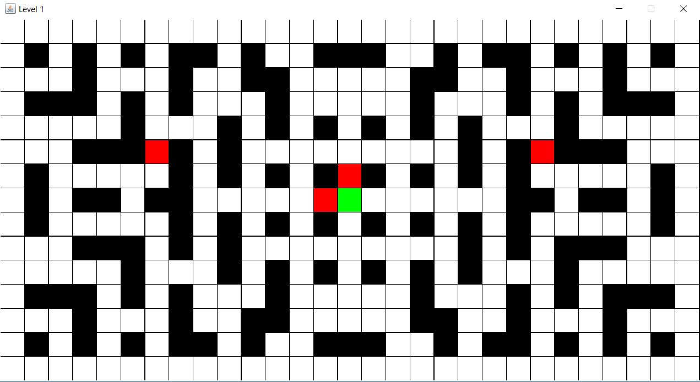

# CS113-FGP-Graph
## Final Group Project for CS113 - Graph

Complete the `Graph` class, either as an adjacency list or adjacency matrix, per the ADT proposal in the lecture slides along with an advanced algorithm (Dijkstra's, Prim's, DFS, BFS, or some other one we haven't covered [clear with instructor first]).  Use the data structure in a core/useful way for your groups idea. Ideally (but not required), you should include a GUI frontend to showcase your project.

**Use Scrum (Agile) development to build your group project over 3 weeks:**
- Sprint 0 = planning sprint
	- End of sprint should have: project proposal/description, decide graph algorithm, initial UML + sequence diagram
- Sprint 1 = first half of development
- Sprint 2 = second half of development
	- End of sprint should have: project completed+documented, screenshots, updated UML+sequence diagrams
- *See past group projects for general sprint requirements (i.e., unit tests for each sprint, updated documentation, etc.)*

**You will be graded on the following:**
- Complete/updated UML Class and relationship diagram
- Complete/updated Sequence diagram for driver (main part of program that creates objects, does user input, etc.)
- JUnit tests for all model classes + data structure (Graph)
	- Note: GUI classes need not have JUnit tests
- All code documented (author boxes, algorithm for driver, methods have description/precondition/postcondition, class invariants)
- No crashes/compile issues
**- Every group member writes significant amount of code**, ideally proportional to other members.

> ***NOTE:***
> - You'll be tempted to push the project off for the end, or give certain group members monolithic parts (someone build the Graph, someone build the GUI, etc.).  **DON'T!**  Embrace the agile development process! Plan in Sprint 0, build a working product by the end of Sprint 1 and Sprint 2.
> - Trouble splitting up the UML/sequence diagram? Build them together! That way everyone's on the same page! 
> - Plan plan plan plan! When you're done planning, PLAN SOME MORE!
> - Create and use Trello boards, Slack, etc. to help you all communicate and organize yourselves

## Project proposal/description:
We are going to make a maze game. The player(green box) is supposed to run away from enemies(red boxes) The purpose of the game is
to survive the longest without being touched by the enemies. As soon as the player is touched the game will come to an end.
 

## Graph algorithm used:
With this game we are using dijkstra algorithm. The algorithm is used in the movement of the enemy for pathfinding.

## Screenshot(s):

## UML Class+Relationship Diagram:

## Sequence Diagram (for driver):

